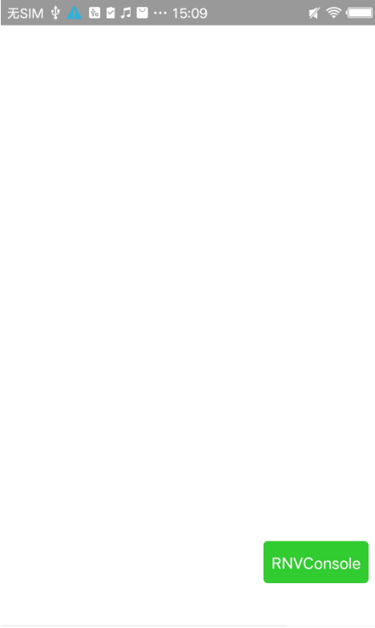
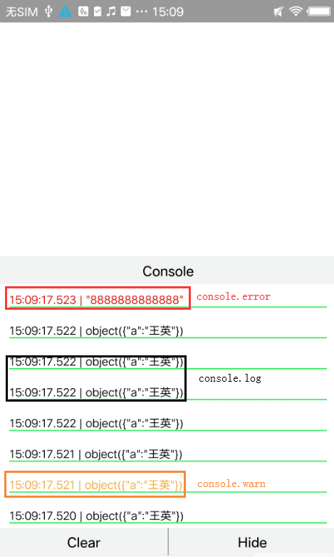
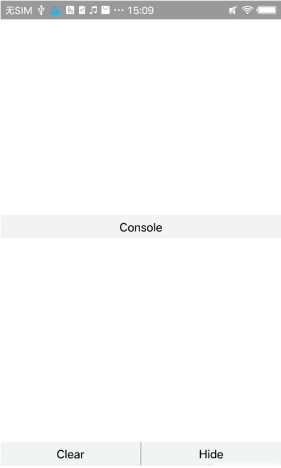

# vconsole-react-native

## 简介
react native开发中用于在开发和测试环境查看log的组件，支持清空和隐藏log区域操作。

## 使用方法
* 安装
```js
$ tnpm install @tencent/vconsole-react-native --save
```

* RN页面之前调用如下方法：
```js
let RNVConsole = require('@tencent/vconsole-react-native').showLogWhenDev();
```
* 在调用页面的根组件下添加 *{RNVConsole}*，（不建议RNVConsole的父组件中包含ScrollView，避免定位问题。建议根组件的最后添加，避免层级问题）

## log查看方式

* 字符串类型*String*: 双引号包裹 "log内容";
* 对象类型*Object*: 为object()包裹，经过JSON.stringfy()处理后的JSON串，例如：{a: 8888} => object({"a": "88888"})
* 数组类型*Array*: Array(数组长度)[]。例如：[1,2,3] => Array(3)[1,2,3];

## 主要界面展示：







